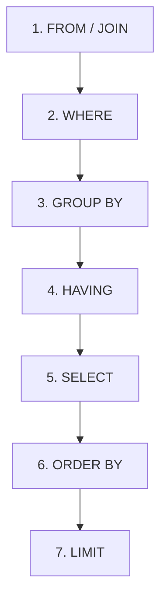

# 06 Selecting & Querying Data

## 1. Basic Data Retrieval

### Selecting Specific Columns vs SELECT *
While `SELECT *` fetches all columns, specifying column names is more efficient and safer for database performance in production:
```sql
-- Inefficient for large tables
SELECT * FROM users;

-- Better practice
SELECT id, name FROM users;
```

---

## 2. Table Inspection Methods (Doubt Resolved)
Running `SELECT *` on large tables is extremely slow and resource-heavy. Here are cleaner and more efficient alternatives to view your table structure and sample data:

1. **`DESCRIBE users;`** or **`DESC users;`**
   Instantly displays the columns, data types, nullability, keys, and default values without running queries on rows.
2. **`SHOW CREATE TABLE users;`**
   Shows the exact SQL statement used to create the table, which is highly useful to check constraints.
3. **`SELECT * FROM users LIMIT 10;`**
   Fetches only the first 10 rows. This allows you to inspect data format safely without putting a heavy load on the server.

---

## 3. Filtering and Conditions

### The `BETWEEN` Operator (Doubt Resolved)
The `BETWEEN` operator matches values within a range.
- **Rule of Thumb:** `BETWEEN` is **inclusive** in SQL.
- `col BETWEEN A AND B` is equivalent to `col >= A AND col <= B`.

#### Date vs. Datetime Caution:
- For a plain **`DATE`** column (like `dob`), boundary dates are fully included.
- For a **`DATETIME`** column (like `created_at`), the date `'2001-02-01'` is treated as `'2001-02-01 00:00:00'`. Therefore, any row created on that day at, say, `10:30:00 AM` is **not** selected because it is greater than midnight.
  - *Best Practice for Datetime ranges:*
    ```sql
    WHERE created_at >= '2001-01-01' AND created_at < '2001-02-02'
    ```

---

## 4. Comparing NULL and Three-Valued Logic (Doubt Resolved)

### Why doesn't `WHERE dob = NULL` work?
In SQL, `NULL` represents an **unknown** or **missing** value. It is not equivalent to zero or an empty string.
- SQL uses **Three-Valued Logic**: `TRUE`, `FALSE`, and `UNKNOWN`.
- Any equality or inequality comparison with `NULL` yields `UNKNOWN`.
  - `5 = NULL` $\rightarrow$ `UNKNOWN`
  - `NULL = NULL` $\rightarrow$ `UNKNOWN`
  - `NULL <> NULL` $\rightarrow$ `UNKNOWN`
- Since a `WHERE` clause only returns rows where the condition is `TRUE`, a query with `WHERE col = NULL` will always return an **empty set**.

### Correct Syntax for NULL:
```sql
-- Find rows where column is empty
SELECT * FROM users WHERE dob IS NULL;

-- Find rows where column is NOT empty
SELECT * FROM users WHERE dob IS NOT NULL;
```

---

## 5. Sorting and Execution Order

### Sorting Data with `ORDER BY`
`ORDER BY` sorts the presentation of the query results.
- **Rule of Thumb:** `ORDER BY` **does not mutate** (change) the data in the table. The physical order of the rows in the database remains exactly the same. Think of it like sorting an Excel sheet for viewing only without saving it.

### SQL Logical Order of Query Execution
Although we write `SELECT` first, the database executes statements in the following logical order:



1. **`FROM`**: Identifies target tables.
2. **`WHERE`**: Filters rows.
3. **`GROUP BY`**: Groups filtered rows.
4. **`HAVING`**: Filters groups.
5. **`SELECT`**: Extracts output columns and computes expressions.
6. **`ORDER BY`**: Sorts final output rows.
7. **`LIMIT`**: Restricts the count of output rows.
